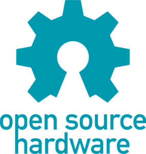
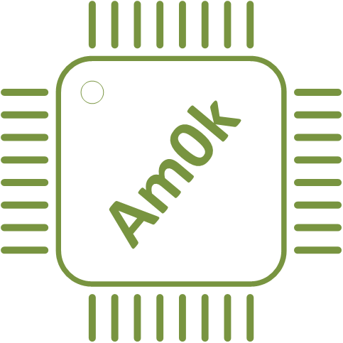
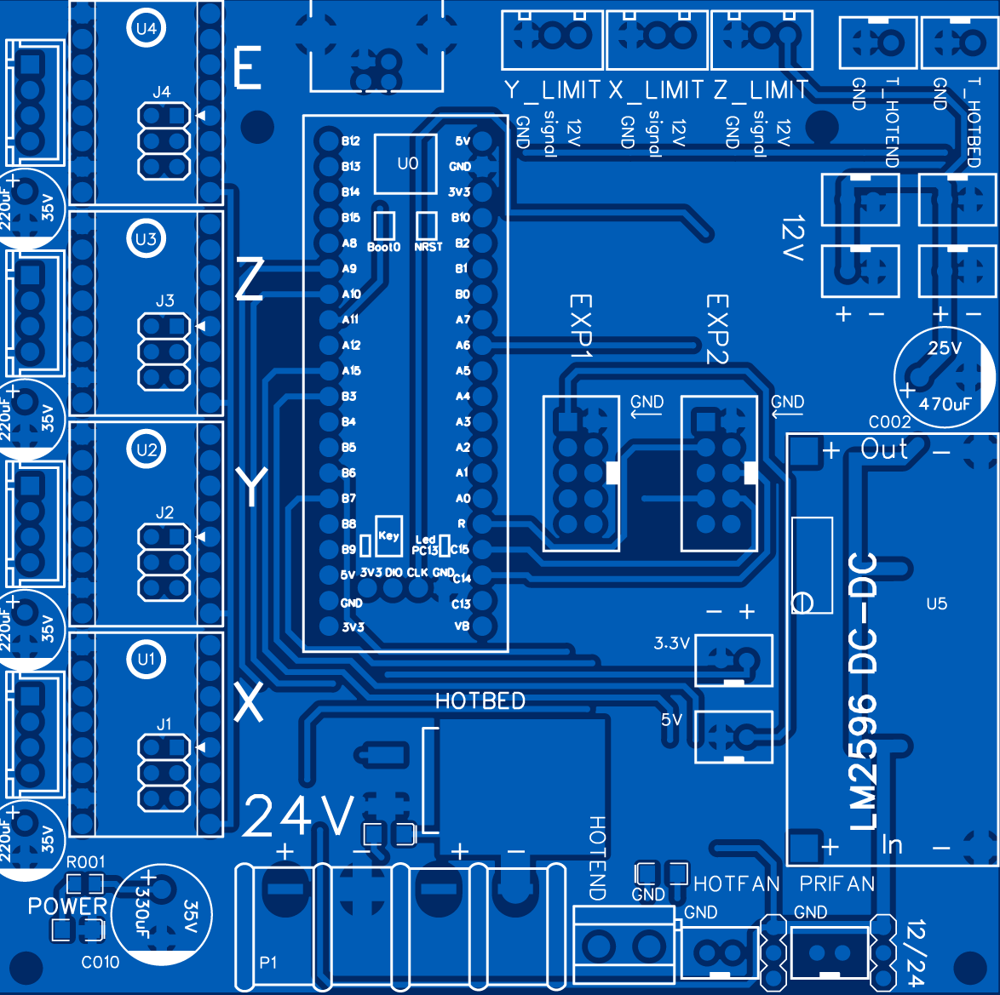
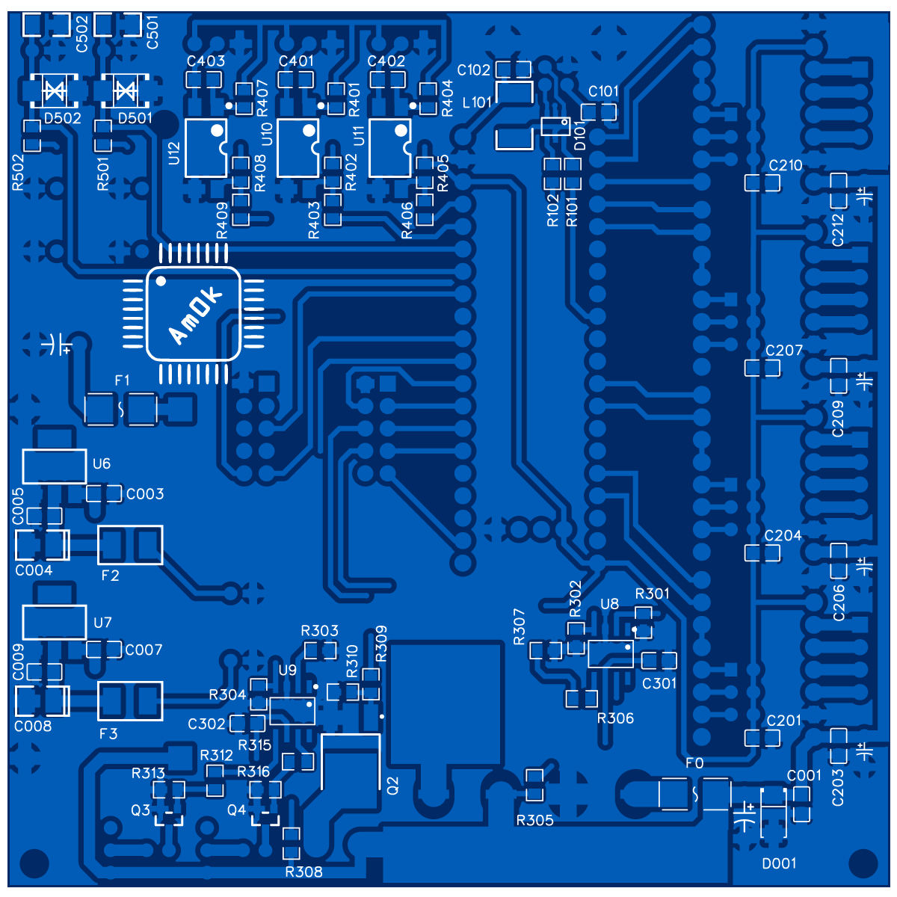
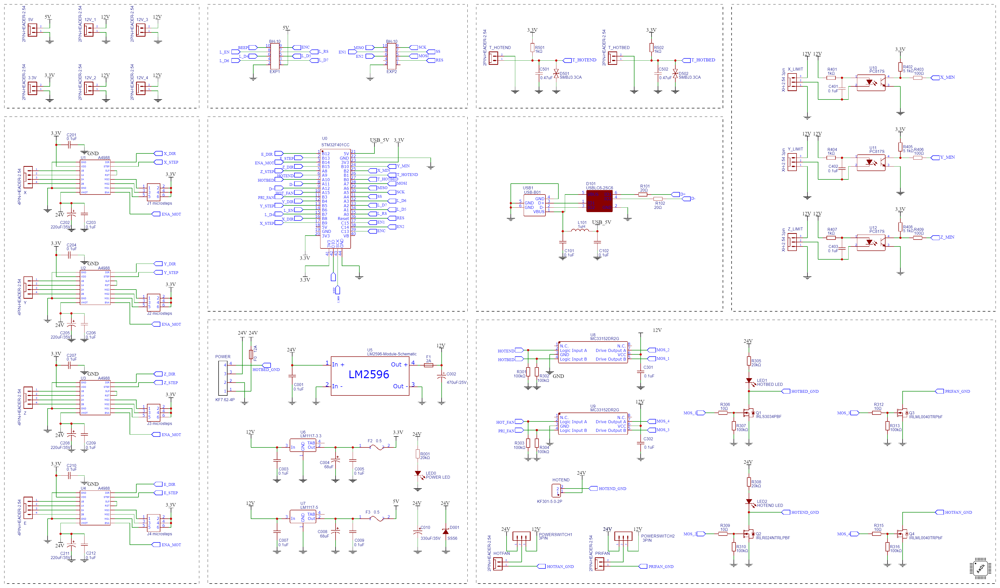

  
  
  
  

<h1 align="center">STM32F401CCU6 3D Printer board</h1>

    

Проект открытой материнской платы 3D принтера на основе МК STM32F401CCU6.
По <a href="https://github.com/Am0k-GIT/STM32F401CCU6_UNI">ссылке</a> доступен обновленный вариант универсальной управляющей платы (совместимости по пинам нет).

## Marlin 2.1.2

Плата поддерживает и протестированна с прошивкой на базе Marlin 2.1.2. В репозитории вы можете найти как сами исходники модифицированной прошивки с уже добавленной поддержкой платы, так и инструкцию по модицикации оригинальных исходников <a href="https://marlinfw.org/meta/download/Marlin">Marlin</a>. Для компиляции использовался <a href="https://code.visualstudio.com">Visual Studio Code</a> с установленным PlatformIO, перед сборкой выбираем окружение [env:blackpill_f401cc_uni]. Так же вам могут быть полезны следующие программы для заливки прошивки по DFU:
 * <a href="https://www.st.com/en/development-tools/stsw-stm32080.html">DfuSe USB device firmware upgrade</a>
 * <a href="https://www.st.com/en/development-tools/stm32cubeprog.html">STM32 Cube Programmer</a>

  
  

## Особенности

Схему печатной платы, а так же гербер-файлы, необходимые для ее производства, вы найдете в репозитории.

Из особенностей следует отметить:
- Это минималистичная плата на основе современного и дешевого 32-битного МК STM32F401CCU6, для интеграции в нее подойдет
отладочная плата от WeAct, известная как BlackPill. Она дешевле и производительнее отладочных плат, основанных на
8-битном МК AtMega2560, рассчитаных на Ramps.
- Питание платы осуществляется от блока питания 24 В, никаких дополнительных линий питания не требуется. Питание нагревателя
экструдера и нагревателя стола осуществляется напряжением первичного питания, для питания нагревателя стола вы можете
установить твердотельное реле и стол на 220 В, запитав его сигнальную низковольтную часть непосредственно от выходных клемм.
- Питание вентиляторов обдува нагревателя экструдера и обдува модели можно выбрать: 12 В или 24 В, установив джампер в соответствующее положение.
- Дополнительное питания 3.3 В, 5 В, 12В выведено с платы на соответствующие разъемы.
- Вы можете подключить лишь 4 драйвера шаговых двигателей, 3 для осей, 1 для экструдера.
- Вы можете подключить нагреваемый стол с потребляемым постоянным током до 15 А, заменив SMD предохранитель на плате.
По умолчанию установливается предохранитель на 12 А.
- Обеспечена дополнительная защита МК: концевые выключатели установлены через опторазвязку, входы АЦП для термодатчиков экструдера и стола защищены от перенапряжения супрессорами, USB интерфейс защищен от электростатических разрядов.
- Плата рассчитана на работу с концевыми выключателями, в которых общий (COM)сигнальный контакт нормально-замкнут на землю и при срабатывании 
коммутируется с +12В. При таком способе подключения выключатель "срабатывает" так же в случае его обрыва или отсоединения от платы. 
Также может быть использован индуктивный выключатель NPN с нормально замкнутым контактом LJ12A3-4-ZAX.
- Изменена входная цепочка измерения температуры. Подтягивающие резисторы установлены с сопротивлением 1kΩ, что обеспечивает большее количество отсчетов АЦП в диапазоне температур 80-300 C, а значит и большую точность поддержания заданной температуры.
К сожалению, это снижает количество отсчетов АЦП при температурах, близких к комнатным, однако, они не являются рабочими.

## Лицензия

Принципиальная схема, BOM-лист, аннотации к нему и файлы для производства находятся под действием [CERN Open Hardware Licence Version 2 - Strongly Reciprocal](/LICENSE.txt). Исходный код примеров прошивок публикуется под лицензиями, которым подчиняется оригинальный исходный код. Ответственность за использование любых материалов этого репозитория целиком и полностью лежит на вас. Я верю в открытую разработку силами энтузиастов, и прошу вас так же делиться своими наработками. Если же вы собираетесь использовать эти наработки в закрытом виде или защищенном патентом виде, прошу вас выбрать другие источники.